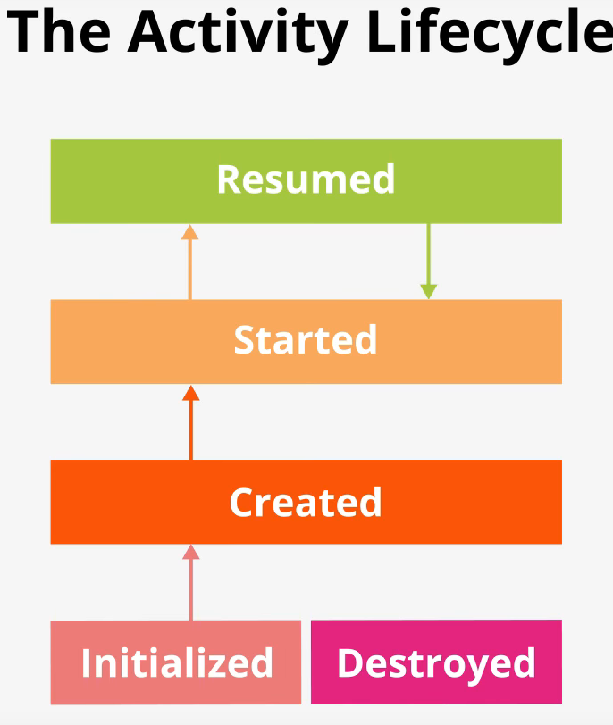
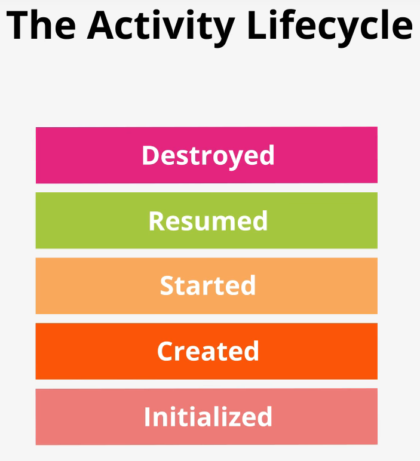
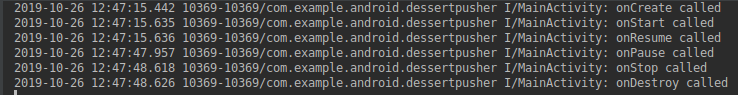
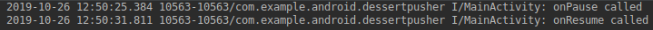
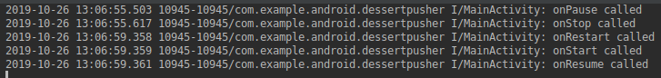
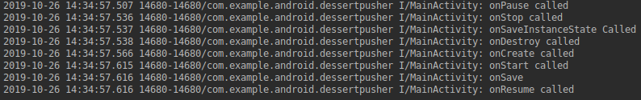
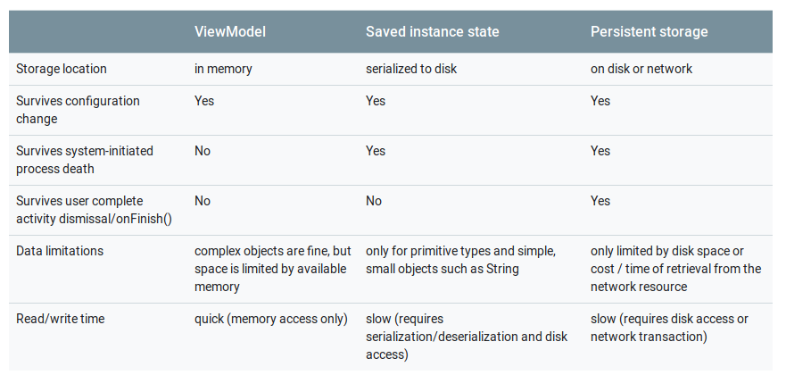

# Repository zum Udacity Course - Leithenmayr

# Lesson 1
## 1.1 Einführung in den Android Kurs (Welcome to developing Android Apps)
Vorrausetzungen: Android Studio, Kotlin Kenntnisse
Inhalt des Kurses: Jetpack Architektur und Android Grundlagen

## 1.2 Dice Roller
In Lektion 1.2 soll man Android Studio installieren und es wird einem erklärt das man in diesem Kurs seine eigene erste Android von Grund auf erstellen wird.

## 1.3 Installing Android Studio
In Lektion 1.3 installiert man nun Android Studio und falls nötig den Android Emulator.

## 1.4 Creating the Dice Roller Project
In Lektion 1.4 wird das Dice Roller Project angelegt. 

* Start a new Android Studio project
* Auswählen von "Empty Activity"
* Eingeben des Projektnamen: Dice Roller
* Minimum API Level ist API 19 (Android 4.4)
* Fertig

## 1.5 Running your First App
Man kann die neu erstellte App auf einem echten Android Gerät (Smartphone, Tablet) laufen lassen, oder auf einem Emulator.

## 1.6 Running your First App on an Emulator
In dieser Lektion wird gezeigt wie man einen neuen Emulator erstellt.


* AVD (Android Virtual Device) Manager öffnen
    * Im AVD Manager kann man links die verschiedenen Kategorien sehen: Fernsehr, Smartphone, Uhren, Tablets
* Create Virtual Device Button anklicken
* In der Kategorie "Phone" wird das Pixel 2 ausgewählt, welches den Play Store verfügbar hat
* Anschließend muss man eine Android API Version wählen (in diesem Fall wird 28 - PIE gewählt) und downloaden
* Nun startet man die APP im Emulator und Hello World erscheint

## 1.7 Running your First App on a Device
In dieser Lektion 1.7 wird erklärt wie man seine Android Apps auf eine echtes Gerät deployed.
(Dazu muss man in den Einstellung 7 mal auf die Buildnummer des Gerätes klicken und den USB Debugging Mode aktivieren, Verbinden mit PC)

## 1.8 Student Interview: Part 1
In dieser Lektion 1.8 werden verschiedene Menschen, die diesen Kurs absolviert haben interviewt. Der großteil war sehr begeistert und schwärmte davon das man anfangs simple Apps und später immer komplexere Apps entwickelt.

## 1.9 Main App Anatomy
In dieser Lektion 1.9 werden die verschiedenen erzeugten Ordner näher erläutert. Man sollte darauf achten, dass man im Project Ordner mit den Datein / Ordnern im Android Studio ganz oben die Option Android ausgewählt hat.

* manifest Folder (AndroidManiFest.xml mit allen Details zur App, Startpunkt,etc. wird festgelegt)
* Java Folder (two test folders and source file folder with MainActivity)
* generatedJava (automatisch generiert)
* res Folder (ressource Folder mit allen Static Kontext: Strings, Icons, Images etc.) 
* Gradle Scripts sind für das builden zuständig

## 1.10 Quiz: App Anatomy
Ist ein Quiz über Lektion 1.10

## 1.11 Activity and Layout
Zu einer Activity Kotlin Klasse gehört ein XML - File, wo das Layout der Activity "beschrieben" ist. Eine Activity ist eine Bildschirm - Seite in einer Android App.
</br>Vereinfacht gesagt ist in der XML Datei das Layout und in der Kotlin Klasse die Logik und was die App macht. Diese beiden Files sind miteinander über Layout Inflation verbunden.
Die "Inflation im Android Kontext ist das Parsen einer XML Datei in UI- orientierte Daten Strukturen.

## 1.12 Exercise: Hello Android
In dieser Lektion 1.12 wird der Text von "Hello World" zu "Hello Android" umgeschrieben.
Weiteres wird etwas detailierter auf die View Elemente und Tags eingegangen.

## 1.13 Adding the Button
In dieser Lektion 1.13 wird gezeigt wie man einen Button zu der Android App hinzufügt.
* android:layout_width="match_parent" - sagt aus das sich das Element an sein Root Element anpasst (beim äußeren LinearLayout ist es der Bildschirm)
* android:layout_height="wrap_content" - sagt aus das die Höhe des Layout exakt so hoch wie der Content innerhalb des Elementes ist
* android:orientation="vertical" - sagt aus das die Elemente unter einander angeordnet werden (Buttons,etc.), Gegenteil wäre horizontal (nebeneinander)
* android:layout_gravity="center_vertical" Anordnung des Elements mittig
* Hardcoded Strings im XML File sollten in ein eigenes String Ressource File ausgelagert werden (Bessere um mehrere Sprachen anzubieten und Veränderungen der strings einfacher und dynamischer zu gestalten)

## 1.14 Exercise: Adding the Button
In dieser Lektion 1.14 muss man das Tutorial von 1.14 nun selber machen.

## 1.15 Connecting the Button
Als nächstes wird der Button mit der Activity Kotlin Klasse verbunden, wie das grob funktioniert wird in dieser Lektion näher erklärt.
* Wenn man einem Button eine Id gibt, wird diese Id im R File abgespeichert und kann mittels `findViewById(R.id.roll_button)` den Button finden

## 1.16 Exercise: findViewById
In dieser Übung wird der Text des Buttons dynamisch über die Kotlin Klasse verändert.

## 1.17 Exercise: OnClickListener
In dieser Übung wird im Kotlin Code auf einen Button Klick reagiert und ein Toast (Push Benachrichtigung) ausgegeben.

## 1.18 Exercise: Change the Text
In dieser Übung wird nun eine Random Zahl mit Hilfe von der Klasse Random zwischen 1 und 6 erzeugt.

## 1.19 Dice Images
Einführung in die nächste Übung, in welcher wir die Random erzeugten Zahlen nun in Images umwandeln. (`val randomInt = Random().nextInt(6) + 1`)

## 1.20 Exercise: Adding the Image Resource
In dieser Übung werden die Images eingebunden in den drawable Folder des Projekts.

## 1.21 Exercise: Adding the ImageView
In dieser Übung werden die Zahlen nun durch Images ersetzt, mit einer when expression.

## 1.22 Student Interview: Part 2
In dieser Lektion 1.22 werden wieder Kurs Absolventen interviewt, wie es Ihnen bei den ersten Schritten mit Android ging. (Einer erwähnte das die Android Dokumentation sehr gut ist)

## 1.23 Exercise: Finding Views Efficiently
In dieser Lektion 1.23 wird sich um effizienten und leserlichen Code gekümmert. findViewById ist sehr performancelastig. (Besser man erstellt lokale Variablen auf die Views). Dabei wird das Kotlin Keyword `lateinit` verwendet, welches sicherstellt das vor dem ersten Aufruf der Variable ein Wert zugewissen wird und somit nicht null ist.

## 1.24 Namespaces
Es gibt in der XML Datei (View) verschiedene Namespaces. Zum Beispiel wenn man jetzt in der Preview ein Foto angezeigt haben möchte, aber später in der echten Android App nicht mehr kann man den Namespace tools verwenden (`tools:src="@drawable/dice_1"`), welcher nur für die Preview gedacht ist.

## 1.25 Introduction to Gradle
Gradle ist das Build Tool von Android. Ist verantwortlich für das Kompilieren, Dependencies hinzufügen, Automated Tests, ... Am Schluss kommt ein APK File heraus. Es gibt verschiedene Module, welches jedes ein eigenes Gradle File besitzt.

## 1.26 Build.gradle
Repository in Gradle ist ein externer Server, wo die Librarys heruntergeladen werden. In dem build.gradle im App Ordner werden die Grundlegenden Dinge des Projektes festgelegt. ApplicationId ist die Id, mit welcher Google die Applikation identifziert. (Es darf maximal eine App mit der selben ApplicationId auf einem Gerät installiert werden, muss eindeutig sein).

## 1.27 Android Compatibility
Android ist auf vielen verschiedenen Geräten verfügbar. (Tablets, Smartphones, Fernsehr, Uhren). API - Level sind dafür wichtig. Umso niedriger das API - Level, desto mehr Geräte können die APP benutzen. Man kann innerhalb im Code checken, welche Android Version verwendet wird. Die Wahl des API - Levels sollte gut bedacht werden. AndroidX ist Namespace von Android JetPack.

## 1.28 Exercise: Vector Drawables
Vektorimages (in diesem Fall die Würfelseiten) sind als Vektorformat erst mit dem API - Level 21 verfügbar. Gradle macht aber einfach bei Geräten mit dem API - Level darunter ein png File daraus, was mehr Speicherplatz benötigt. Abhilfe, das man diese PNG Files nicht hinzufügen muss ist (`vectorDrawables.useSupportLibrary = true`). Weiteres verwendet man im Layout den App Namespace, welcher nicht von dem Android Framework direkt kommt. (`xmlns:app="http://schemas.android.com/apk/res-auto"`)

## 1.29 Recap
In dieser kurzen Lektion wird die erste Lesson zusammengefasst.

# Lesson 2
## Leson 2.1 Art with Aleks
Die Lektion 2.1 ist nur eine kurze Einführung. Im groben geht es um Constraintlayouts, und was man damit machen kann (Horizontale und Vertikale Anordnung von Elementen).

## 2.2 Introduction
Die Lektion 2.2 ist eine weitere Einführung, um was es geht in dieser Lesson, nämlich Layouts. Weiteres wird es um Databinding gehen.

## 2.3 View Groups & View Hierarchy
Alle Element leiten von der View Klasse ab, welche eine Höhe, eine Breite und einen Hintergrund haben. (Beispiel. Textview, Button, Colour Pickers, etc.) Man kann auch seine eigene Custom View implementieren.
Einheit: `Density Independent Pixel (dp)` (automatische Konvertierung auf Android Geräten). Layouts fassen mehrere Views zusammen. Umso mehr Layouts man hat umso schlechter ist die Performance.

## 2.4 Exercise: Create the AboutMe Project
In dieser Lektion wird lediglich das neue Projekt "AboutMe" angelegt.

## 2.5 Exercise: Create the Layout File
In dieser Lektion wird das Android Layout File mit Hilfe von Android Studio erstellt. Layout Files werden im res/layout Ordner gespeichert. Um ein neues Layout File hinzuzufügen klickt man auf den res Ordner mit der rechten Maustaste und wählt New/Android Resource File. Anschließend vergibt man einen Namen und wählt unter Resource type Layout aus.

## 2.6 Layout Editor Basics
In dieser Lektion wird der visuelle Designer zum Erstellen von View gezeigt und die Basics erklärt. In der Component Tree werden alle Elemente (Kind + Eltern Element angezeigt). Abschließend gibt es ein kleines Quiz.

## 2.7 Adding a TextView
In der Lektion 2.7 wird ein TextView Element zum xml File hinzugefügt. Anschließend werden einige Attribute gesetzt, wie zum Beispiel eine ID, oder es wird gezeigt wie man den Text nicht als hardgecodeden String in das XML File schreibt sondern ein extra string ressource file anlegt.

## 2.8 Styling a TextView
In dieser Sektion wird die TextView mit Hilfe von Padding ausgerichtet.Padding zwischen Content und Border. Margin ist außerhalb der Border. Weiteres wird ein anderes Font eingestellt (Roboto Font - Regular). Weiteres wird gezeigt wie man den Style eines Layout extrahieren kann. Rechtsklick auf eine View Komponente - Refactor - Extract Style

## 2.9 Exercise: Add a TextView, ImageView, and Styling
In dieser Lektion wird ein ImageView eingefügt.

## 2.10 Exercise: Add a ScrollView
Als nächstes werden einige persönliche Informationen hinzugefügt, wo es nicht schlecht wäre, wenn man scrollen könnte. In Android gibt es dafür eine ScrollView, bei welcher man maximal ein Unterlayout hinzufügen kann. 

## 2.11 Adding an EditText for Text Input
Als nächstes wird zu dieser App ein User Input hinzufügt, in Form einer Plain Text Box. Anschließend wird die Validierung hergezeigt und das man einen Hint (Tipp) vergeben kann.

## 2.12 Adding a Done Button to Accept Text Input
In dieser Lektion wird ein neuer Button hinzugefügt und gestylt.

## 2.13 Exercise: Add EditText, Done Button, ClickHandler
In dieser Lektion wird der Button regestriert und welche Logik anschließend ausgeführt werden soll. `findViewById<Button>(R.id.done_button).setOnClickListener {
   addNickname(it)
}` - so kann man einen Button regestrieren.

## 2.14 Data Binding
Das direkte zugreifen auf ein Element mittels findViewById kann in großen komplexen Projekten zu Performance Problemen führen. Um das zu vermeiden kann man mit Hilfe von Data Binding, sogenannte Binding Objekte zur Laufzeit erstellen lassen.

## 2.15 Data Binding: Views
Data Binding muss erstmals aktiviert werden im build.gradle File. Dazu `dataBinding {
        enabled = true
    }` einfügen. Anschließend synct man das Projekt einmal. Nun wird zum Layout ein laout Tag hinzugefügt. Anschließend kann man in der MainActivity Kotlin Klasse ein Binding Objekt erstellen: `private lateinit var binding: ActivityMainBinding`

## 2.16 Data Binding: Data
Data Binding macht den Code lesbarer und performanter. In dieser Lektion wird das erste mal gezeigt wie man in Kotlin eine Data Klasse anlegt.
Data - Block im Layout File:
    `<data>
        <variable
                name="myName"
                type="com.example.aboutme.MyName" />
    </data>`

## 2.17 Exercise: Implement Data Binding
In dieser Lektion wird das gelernte aus den letzten Lektionen nun am Projekt umgesetzt.

## 2.18 Google Interview: John Hoford and Nicolas Roard
In dieser Lektion werden wieder Interviews durchgeführt.

## 2.19 Constraint Layout: ColorMyViews App
Was ist ein Constraint? - Ein Constraint ist eine Verbindung oder eine Ausrichtung zu einem anderen UI - Element, zum Eltern - Layout oder zu einer unsichtbaren (Richt-)Linie. Constraint - Layout haben viele Vorteile: Responsive, Optimiert, Free-Form

## 2.20 Creating ColorMyViews Project
In dieser Lektion wird das ColorMyViews Projekt angelegt.

## 2.21 Exercise: Create ColorMyViews Project and One Box
Als erstes werden in dem neuen Projekt, im Layout File - Autoconnect ausgeschaltet. (im Designer - auf das Hufeisensymbol klicken) - da die Constraints manuell hinzugefügt werden. Weiteres werden noch einige Adaptierungen durchgeführt und gezeigt wie man die Display - Auflösung umstellen kann.

## 2.22 Constraints
In dieser Lektion wird nochmals etwas näher auf Constraints eingegangen. In der absoluten Position wird mit layout_margin gearbeitet. Relative Margins sind immer besser (responsive).

## 2.23 Ratios
In dieser Lektion geht es um Verhältnisse. (Zum Beispiel: Höhe ist 2 zu 1 zur Breite) Somit muss man keine Höhen und Breiten hard codieren.

## 2.24 Chaining
Chaines verbinden horizontale oder vertikale Views. Ein Spread Chain lasst zwischen den View Elementen immer gleich viel Abstand. A Spread Inside Chain, nutzt den ganzen Platz aus. Weighted Chain füllt den ganzen Platz mit den Views aus. Packed Chain with Bios ist so kompakt wie möglich.

## 2.25 - Adding Box Two Below Box One
In dieser Übung, werden nun zum Miniprojekt zwei Constraints hinzugefügt.

## 2.26 - Adding Three Aligned Boxes
Nun werden drei Constraints und Chains hinzugefügt, mit 3 weiteren Textboxen.

## 2.27 - Exercise: Add Aligned Boxes with Click Handlers
In dieser Lektion werden zu den Buttons nun Klick Event Handler hinzugefügt. Wird einer dieser geklickt wird er farbig angezeigt.

## 2.28 - Baseline Constraint
In dieser Lektion wird gezeigt wie man Baseline Constraints hinzufügt. Weiteres werden zwei neue Textboxen hinzugefügt.
 
 ## 2.29 - Exercise: Add Baseline Constraint and Button Chain
 Abschließend werden noch Buttons mit Event Handlern hinzugefügt, um die Boxes mit den Buttons einzufärben.

 ## 2.30 - Where to Go Next?
 Nun ist die Design - Lektion zu Ende.

 # Lesson 3
 ## 3.1 - The Guide and the Traveler
 Einführungsvideo: Um was geht es in der Lektion.

 ## 3.2 - Android Navigation Patterns
 In diesem Video wird die App erklärt, wobei mehrere Views erstellt werden. Hauptsächlich geht es um Navigation.

 ## 3.3 - Quiz: Navigation Terms
 Quiz!

 ## 3.4 - Fragments
 In Android 3.0 Honeycomb wurden Fragments eingeführt. Eine Activity enthält UI Fragments. Ein Fragment ist eine View innerhalb einer Activity. Man kann zwischen Activities oder auch Fragmenten innerhalb einer Activity navigieren. Die Activites werden im Back Stack gespeichert. Es gibt auch einen Fragment Back Stack (Fragment Manager). Man kann beide kombinieren.

 ## 3.5 - Quiz: Fragment Basics
 Quiz!

## 3.6 - Exercise: Project Tour
Im AndroidManifest.xml ist die Start Activity festgelegt. Im /res Ordner sind animationen, drawables und layouts, menues gespeichert. Weiteres bekommt man ein Template Projekt.

## 3.7 - Exercise: Creating and Adding a Fragment
In dieser Übung wird ein Fragment erstellt und zum main layout hinzugefügt.

## 3.8 - Navigation Component
Prinzipien von der Navigation in Android: 
* Es gibt immer einen Startpunkt (Startscreen), sollte auch der letzte Screen sein. 
* Man sollte immer zurück navigieren können.
* Up Button sollte immer da sein (zum zurück navigieren)

## 3.9 - Exercise: Let’s Navigate Already
In dieser Übung wird ein Navigation Graph erstellt.
* Navigation File erstellen im res Ordner, um ein Fragment zu erstellen.
* In der navigation.xml das Fragment mit dem Nav Host Fragment (Parent Element) verbinden.
Wechseln eines Fragments:
````
binding.playButton.setOnClickListener (
            Navigation.createNavigateOnClickListener(R.id.action_titleFragment_to_gameFragment)
        )
````

## 3.10 - Principles of Navigation
Die Prinzipien von 3.8 werden nochmals wiederholt.

## 3.11 - Exercise: Conditional Navigation
In dieser Lektion wird ein Spiel gewonnen und Spiel verloren Fragment hinzugefügt.

## 3.12 - Exercise: Back Stack Manipulation
Das Problem ist wenn man am Android Handy auf die Zurücktaste klickt navigiert man einfach eine Frage zurück und kann sie richtig beantworten. Um das zu vermeiden muss man das Fragment vom Backstack löschen.

## 3.13 - Quiz: Back Stack Manipulation
Quiz!

## 3.14 - Exercise: Adding Support for the Up Button
Der Up - Button ist oben links (nicht immer) um zurück zu navigieren. In dieser Lektion wird dieser implementiert.

## 3.15 - Android Navigation - Up vs Back
Quiz!

## 3.16 - Google Interview: Ian Lake
Interview!

## 3.17 - Exercise: Adding a Menu
Nun wird ein "About" Tab (Fragment) im Overflow Menü hinzugefügt.

## 3.18 - Quiz: Matching Menu Attributes
Quiz!

## 3.19 - Exercise: Adding Safe Arguments
Nun werden Argumente zwischen zwei Fragmenten übergeben. (Anzahl der Fragen, Anzahl der richtigen Fragen)
Argumente werden im Android Bundle übergeben (HashMap (Key - Value)). Um zu vermeiden das es zu Bugs aufgrund von falschen Datentyp kommt, gibt es SafeArgs.

## 3.20 - Why do we have Safe Arguments?
Quiz!

## 3.21 - Intents and Sharing
Nun geht es darum zum Beispiel die Kamera des Gerätes zu verwenden oder auf die Kontakte zuzugreifen. Diese erfolgt durch sogenannte Intents. Mit Sharing kann man Dinge über Social Networks, Emails, etc. mit anderen Usern teilen.

## 3.22 - Quiz: Explicit vs Implicit Intents
Quiz!
* Explizit Intents: Starten eine Aktivität basierend auf seinem Klassennamen
* Implicit Intents: Starten eine Aktivität basierend auf den Parametern, wie Actions, Daten und Datentypen

## 3.23 - Exercise: Adding Sharing with an Intent
Nach dieser Übung/Lektion kann man nun das Ergebnis mit Hilfe von Sharing und Intents mit jemanden anderen teilen.

## 3.24 - Exercise: Adding the Navigation Drawer
In dieser Übung wird der Navigation Drawer hinzugefügt, welcher von links/rechts herausklappt um besser zu navigieren. Man kann darauf zugreifen über das Hamburger Item oder indem man von links nach rechts swipt. Er ist Teil der Material Library.

## 3.25 - Summary of Navigation
Zusammenfassung dieser Lektion.

## 3.26 - Quiz: How to Navigate
Quiz!

## 3.27 - Exercise: Using Navigation Listeners
Prinzipiell kann man während jedem Fragment den Navigation Drawer herausswipen. Während dem Spiel möchte man dies allerdings nicht. In dieser Übung wird gezeigt, wie das verhindert wird.

## 3.28 - Exercise: Animation with Navigation
In dieser Übungen werden noch ViewAnimations hinzugefügt. Alpha beschreibt dabei wie transparent etwas ist. (0% ist es unsichtbar)

## 3.29 - Quiz: Animation Attributes
Quiz!


# Lesson 4
## 4.1 - The Case of the Missing Data
In dieser Lesson wird der Android Activity Lifecycle erklärt. Das Problem ist nämlich aktuell, wenn man sein Handy dreht oder die App schließt, gehen die Daten verloren.

## 4.2 - Why Track Activity State?
### Activity Lifecycle


### States of Activity


## 4.3 - Exercise: Introduction to the Activity Lifecycle Diagram

Lifecycle Methoden:
* onCreate: Wird aufgerufen wenn die Activity schon erstellt wurde aber noch nicht sichtbar ist
* onStart
* onResume
* onDestory
* onPause
* onStop
* onRestart

## 4.4. - Exercise: Introduction to Logging
In dieser Übung wird simples Logging in Android erklärt:
`Log.i("MainActivity", "onCreate called"` 
Die Message wird in Android Studio im LogCat angezeigt.

## 4.5 - Exercise: The Application Class and Timber
Die Logging library Timber wird vorgestellt.
`implementation 'com.jakewharton.timber:timber:4.7.1'`im build.gradle File hinzufügen
`Timber.i("onCreate called")`

## 4.6 - Lifecycle: Open and Close
In dieser Übung soll geloggt werden in welcher Reihenfolge die Lifecycle Methoden aufgerufen werden.


## 4.7 - Lifecycle: Share dialog
Welche Lifecycle Methoden werden aufgerufen wenn man etwas teilen möchte.



## 4.8 - onCreate vs onStart
* onCreate wird aufgerufen wenn die App erstellt wird
* onStart wird aufgerufen wenn die App geöffnet wird (z.B. auch aus dem Hintergrund)

## 4.9 - Activity Lifecycle States and Callbacks Summary
Zusammenfassung der letzten Lektionen.

## 4.10 - Lifecycle: Navigate Away
Man sollt die App öffnen, dann denn Home Button klicken und zum Homescreen navigieren. Dann soll man zurück zur Activity gehen. Welche Methoden werden in welcher Reihenfolge aufgerufen?



## 4.11 - Google Interview: Dianne Hackborn
Interview!

## 4.12 - Exercise: Setup and Teardown
Um zu verhindern das ein Timer weiterläuft obwohl die Activity nicht sichtbar ist, kann man die Lifecycle Methoden onStart bzw. onStop verwenden. Startet man etwas in onCreate sollte man es in onDestroy wieder zerstören.

## 4.13 - Introduction to the Lifecycle Library
Bis 2017 gab es nur die Lifecycle Methoden und dann wurde die Lifecycle Library veröffentlicht, mit der es leichter ist die erstellten Objekte auch wieder zu zerstören, sodass es nicht zu Bugs kommt.

## 4.14 - Exercise: Lifecycle Observation
LifecycleObserver: überwacht einen LifecycleOwner, wie z.B. eine Activity oder ein Fragment. Dieser Mechanismus beruht auf dem Observer Pattern. 
`@OnLifecycleEvent(Lifecycle.Event.ON_START)` - Starten
`@OnLifecycleEvent(Lifecycle.Event.ON_STOP)` - Beenden

## 4.15 - Process Shutdown
In dieser Lektion wird der Process Shutdown erklärt, welcher in 4.16 näher erläutert wird.

## 4.16 - Process Shutdown Demo
Demo mit ADB

## 4.17 - Exercise: onSaveInstanceState
onSaveInstanceState ist ein Callback, wo Daten gespeichert werden, falls eine Activity in den Hintergrund rückt. Das Bundle an Daten sollte unter 100 kB sein, was aber von Gerät zu Gerät unterschiedlich ist. Wenn das Bundle in OnCreate nicht null ist weiß man das die Activität schonmal erstellt wurde. Weiteres wird gezeigt wie ein Bundle wiederhergestellt werden kann.

## 4.18 - Configuration Changes
Man soll das Gerät drehen und überprüfen welche Lifecycle Methoden aufgerufen werden:



Man sollte immer die super Methode aufrufen, ansonsten crasht die App.

## 4.19 - The Future of Lifecycles
Abschlussvideo!

# Lesson 5
## 5.1 - Architecting on the Fly
Einführungsvideo: Flexible Architekturgestaltung in Android

## 5.2 - Lesson Introduction
In dieser Lektion lernen wir wie man eine Android App richtig strukturiert (ViewModel, LiveData, DataBinding).

## 5.3 - Exercise: Tour of the App
Die App wird vorgestellt. Prinzipiell muss man Wörter erraten.

## 5.4 - Where the App Falls Short
Nun herrscht wieder folgendes Problem. Falls man das Gerät umdreht (waagrecht hält), gehen die Daten verloren (aktueller Spielstand, etc.). Man könnte es wieder über die Methode onSaveInstanceState handeln. In diesem Kurs wird aber eine weitere Methode vorgestellt.

## 5.5 - What is Architecture
Die Daten überleben den Lebenszyklus von einem Fragment nicht, wenn Sie nicht woanders abgespeichert werden. onSaveInstance Bundels haben auch Probleme. Man muss relativ viel extra Code implementieren um die Daten wieder herzustellen. Weiteres kann man nur sehr wenig Daten abspeichern.
**Application Architecture**: Der Entwurf von Applikationsklassen und die Beziehungen zwischen den Klassen (bessere Übersicht). Es gibt keinen einheitlichen Weg für die Architektur. Es kommt immer auf den Anwendungsfall an. In dieser Lektion wird das MVVM (Model - View - View Model) erklärt.

## 5.6 - Our App Architecture
Seperation of Concerns (Trennung nach Besorgnis): Aufteilen des Codes in Klassen, jede mit einem seperaten, gut definierten Verantwortlichkeiten. 
* UI - Controller: Activties and Fragments (UI - bezogene Dinge: UserInput, User Events etc.), Business Logik sollte nicht darinn vorkommen (Berechnungen, etc.)
* ViewModel: Hält die Daten für die UI - Controller und bereitet sie auf das visualisieren her
* LiveData: Bringen die Daten vom ViewModel in die UI

## 5.7 - ViewModel
Ein ViewModel ist eine abstrakte Klasse, welche die UI Daten sammelt. Diese Daten überleben Konfigurationsänderung (Gerät drehen, etc.). Es gibt keine größenLimitierung, wie z.B. bei onSaveInstanceState.

## 5.8 - Exercise: Create the GameViewModel
In dieser Lektion wird ein ViewModel für das GameView Fragment erstellt.
Dazu muss `implementation 'androidx.lifecycle:lifecycle-extensions:2.0.0'` im build.gradle hinzugefügt werden. Weiteres muss von ViewModel abgeleitet werden, sowie das ViewModel mit dem Fragment verbunden werden.

Instanzierung eines ViewModels, erstellt nur beim ersten Mal ein neues ViewModel:
`viewModel = ViewModelProviders.of(this).get(GameViewModel::class.java)`

ViewModel Basic - Klasse: 

````
package com.example.android.guesstheword.screens.game

import android.util.Log
import androidx.lifecycle.ViewModel

class GameViewModel : ViewModel(){
    init{
        Log.i("GameViewModel", "GameViewModel created!")
    }

    override fun onCleared() {
        super.onCleared()
        Log.i("GameViewModel", "GameViewModel destroyed!")
    }
}
````

## 5.9 - What Belongs in the GameViewModel?
Quiz!

## 5.10 - Exercise: Populate the GameViewModel
In dieser Übung werden die Variablen und Logikfunktionen ins ViewModel verlagert. Die Method isGameFinish aus dem Fragment wurde noch nicht entfernt, da diese Navigationsteile enthält. Aber es wird später im Kurs noch erklärt.

## 5.11 - The Benefits of a Good Architecture
Vorteile von einer guten Architektur:
* Organisierter (besser zu handhaben, wenn man im Team arbeitet, etc.)
* Besser und einfacher Debugbar

Das MVVM Pattern, ist es ein unidirektionales Pattern. Das Fragment kennt sein ViewModel, aber das ViewModel sein Fragment nicht. Es ist dadurch besser testbar. Es gibt zwei Arten von Test: 
* androidTest - Ordner (Emulator wird zum Testen benötigt, große/komplexe Tests)
* test - Ordner (kein Emulator wird benötigt, eher kleinere Tests)

## 5.12 - The Power and Limits of the ViewModel
Das Problem mit den verlorenen Daten, wenn man den Bildschirm dreht, wurde mit dem ViewModel behoben. Die Daten gehen nun, nurmehr verloren, wenn das OS (Android) entscheidet, Resourcen freizugeben und die App zu schließen. Die Daten sind dann auch weg.


**Quelle**: https://developer.android.com/topic/libraries/architecture/saving-states

## 5.13 - LiveData
Man benötigt einen Weg um das Fragment, vom ViewModel aus zu verständigen, wenn ein Ereignis eintritt.
LiveData ist eine observable Datenspeicherungsklasse.

## 5.14 - Exercise: Add LiveData to GameViewModel
Um nun ein Datenfeld Observable zu machen muss man seinen Datentyp folgendermaßen ändern:
`var score = MutableLiveData<Int>()`

Den Wert kann man folgendermaßen zuweisen:
`score.value = 0`

Mit Hilfe des Elvis Operator kann man einen Default Wert angeben:
`viewModel.score.value ?: 0`

Anmelden als Observer:
````
viewModel.score.observe(this, Observer{newScore-> binding.scoreText.text = newScore.toString()})
````

## 5.15 - Lifecycle Awareness
LiveData weiß in welche Lifecycle Zustand seine Observer sind. LiveData verwendet diese Information um intelligent zu kommunizieren. LiveData benachrichtigt das Fragment nur wenn das Fragment ab Bildschirm zu sehen ist. Wird das Fragment destroyed, wird die Verbindung selbständig aufgelöst. 

## 5.16 - Exercise: Add LiveData Encapsulation to GameViewModel
In dieser Lektion wird erklärt wie man Fields (Variablen) kapseln kann, sodass nicht jede Klasse/Objekt Zugriff darauf hat.
`MutableLiveData` darf auch bearbeitet werden, `LiveData` darf nicht bearbeitet werden!

Private Setter and public Getter:
````
private var _score = MutableLiveData<Int>()

val score : LiveData<Int>
    get() = _score
````

## 5.17 - Event vs. State
Das Problem das wir wissen wenn das Spiel vorbei ist, ist immer noch nicht gelöst. Das Fragment muss benachrichtigt werden. 
* **State:** Ist ein Zustand, z.B. Button ist grün, etc.
* **Event:** Ist ein Ereigniss, z.B. Button wurde geklickt, etc.

## 5.18 - Exercise: Add End Game Event
In dieser Übung folgt die Implementierung. Die Lösung ist ein Event. Bei diesem Event kann man einen Observer anmelden.

````
private val _eventGameFinish = MutableLiveData<Boolean>()
    val eventGameFinish: LiveData<Boolean>
        get() = _eventGameFinish
````

## 5.19 - Google Interview: Yigit Boyar
Interview!

## 5.20 - Adding a Timer
Nun wird ein Timer implementiert, als Countdown. Dieser soll im GameViewModel implementiert werden.

## 5.21 - Exercise: Add CountDownTimer
In dieser Übung wird nun der Timer mit Hilfe der CountDownTimer Klasse von Android implementiert.

## 5.22 - Exercise: Add a ViewModelFactory
Eine ViewModel Factory ist eine Klasse, welche weiß, wie man ViewModels erstellt.

````
class ScoreViewModelFactory(private val finalScore: Int) : ViewModelProvider.Factory {
    override fun <T : ViewModel?> create(modelClass: Class<T>): T {
        if (modelClass.isAssignableFrom(ScoreViewModel::class.java)) {
            return ScoreViewModel(finalScore) as T
        }
        throw IllegalArgumentException("Unknown ViewModel class")
    }
}
````

## 5.23 - Exercise: Add ViewModel to Data Binding
Wenn sich Daten im ViewModel verändern, werden Sie and den UI Controller (Activity oder Fragment) weitergegeben. Dieser aktualisiert wiederum die View. Umgekehrt sieht es aus, wenn ein Button auf der View gedrückt wird. Dabei benachrichtigt die View den UI - Controller und dieser wiederum das ViewModel.

## 5.24 - Exercise: Add LiveData Data Binding
Nun wird das Projekt ein wenig modifiziert, indem das ViewModel bzw. LiveData direkt mit der View kommuniziert.
Weiteres können String - Ressourcen angegeben werden im "strings.xml" - File.
````
<string name="quote_format">\"%s\"</string>
````
XML - Datei (Verwendung):
````
android:text="@{@string/quote_format(gameViewModel.word)}"
````

## 5.25 - Exercise: LiveData Map Transformation
Nun wird LiveData A (Long Time) zu einem String und somit LiveData B konvertiert.
````
val currentTimeString = Transformations.map(currentTime, {time ->
    DateUtils.formatElapsedTime(time)
})
````

## 5.26 - Optional Exercise: Adding the Buzzer
Vibration optional hinzufügen.

## 5.27 - Recap of Architecture and Lifecycles
Abschlussvideo

# Lesson 6: App Architecture (Persistence)
## 6.1 - Wake Up, Aleks!
Einführungsvideo!

## 6.2 - Introduction
In dieser Lektion wird eine App erstellt, mit welcher die Schlafdauer und Qualität aufgezeichnet und abgespeichert werden kann. Dabei gibt es einen UI - Controller und ein ViewModel mit LiveData und eine Datenbank Klasse. Weiteres wird in dieser Lektion erklärt, wie man mit DAO's (Database Access Object) arbeitet und mit SQL Queries, Daten aus der Datenbank abfragt.

## 6.3 - SQLite Primer
In dieser Lektion werden die Basics von SQL erklärt, welche aber alle für mich klar sind, sodass ich diese nicht weiter ausführen werden.

## 6.4 - Designing Entities
In dieser Lektion wird erklärt, was eine Entität ist und was eine Query ist. Eine Entität ist ein Objekt welches in der Datenbank gespeichert wird. Jede Entität definiert eine Tabelle in der Datenbank. Eine Query hingegen ist, dass man Daten von einer Datenbank anfragt, oder das man eine Anfrage schickt das irgendwas mit den Daten passiert. (Verändern, Aggregieren, etc.)

## 6.5 - Exercise: Creating the SleepNight Entity
In dieser Lektion wird nun eine Entität in Android erstellt. Diese Entitätsklasse hat eine große Ähnlichkeit mit Java Entitäten.

Beispiel:
````
import androidx.room.ColumnInfo
import androidx.room.Entity
import androidx.room.PrimaryKey

@Entity(tableName = "daily_sleep_quality_table")
data class SleepNight(

        @PrimaryKey(autoGenerate = true)
        var nightId: Long = 0L,

        @ColumnInfo(name="start_time_milli")
        val startTimeMilli: Long =  System.currentTimeMillis(),

        @ColumnInfo(name="end_time_milli")
        var endTimeMilli: Long = startTimeMilli,

        var sleepQuality: Int = -1
)
````

## 6.6 - Data Access Object (DAO)
Es gibt in DAO Klassen verschiedene Annotationen wie z.B. @Insert, @Delete, @Update, @Query. Der Compiler checkt SQL Queries, ob Syntax Errors vorliegen.

## 6.7 - Exercise: DAO - SleepDatabaseDao
In dieser Lektion wird ein DAO für die Klasse SleepNight erstellt.

Beispiel:
````
import androidx.lifecycle.LiveData
import androidx.room.Dao
import androidx.room.Insert
import androidx.room.Query
import androidx.room.Update

@Dao
interface SleepDatabaseDao {

    @Insert
    fun insert(night: SleepNight)
    
    @Update
    fun update(night: SleepNight)


    @Query("SELECT * from daily_sleep_quality_table WHERE nightId = :key")
    fun get(key: Long): SleepNight?


    @Query("DELETE FROM daily_sleep_quality_table")
    fun clear()


    @Query("SELECT * FROM daily_sleep_quality_table ORDER BY nightId DESC")
    fun getAllNights(): LiveData<List<SleepNight>>


    @Query("SELECT * FROM daily_sleep_quality_table ORDER BY nightId DESC LIMIT 1")
    fun getTonight(): SleepNight?
}
````

## 6.8 - Creating a Room Database
In dieser Lektion wird erklärt wie nun die Room Database erstellt wird.

## 6.9 - Exercise: Creating a Room Database
In dieser Lektion wird nun eine Datenbankklasse implementiert, wo ein Datenbank Companion Objekt angelegt wird. Siehe SleepDatabase.kt Datei.

## 6.10 - Testing the Room Database
In dieser Lektion werden nun Tests für die Datenbank erstellt.

## 6.11 - Displaying Sleep Data
In dieser Lektion wird die Anwendung visualisiert.

## 6.12 - Adding A ViewModel
In dieser Lektion wird ein ViewModel hinzugefügt, für das Button klicken etc.
0
## 6.13 - Exercise: Adding a ViewModel
In dieser Lektion wird es dann auch bei unserem Projekt hinzugefügt.

## 6.14 - Multithreading and Coroutines
## 6.15 - Exercise: Coroutines for Long-running Operations
## 6.16 - Googler Interview: Florina Muntenescu
## 6.17 - Navigation and Sleep Quality
## 6.18 - Exercise: Recording Sleep Quality
## 6.19 - Transformation Maps
## 6.20 - Exercise: Button States and SnackBar
## 6.21 - Where to go next?

# Lesson 7: RecyclerView
## 7.1 - Recycle Woman
## 7.2 - Introduction
## 7.3 - Your first RecyclerView
## 7.4 - Exercise: Add a RecyclerView
## 7.5 - Exercise: Display SleepQuality Data
## 7.6 - Exercise: Recycling ViewHolders
## 7.7 - Displaying Sleep Quality
## 7.8 - Exercise: Display the SleepQuality List
## 7.9 - Exercise: Refactor onBindViewHolder
## 7.10 - Exercise: Refactor onCreateViewHolder
## 7.11 - Improving Data Refresh
## 7.12 - Exercise: Refresh Data with DiffUtil
## 7.13 - Exercise: Add DataBinding to the Adapter
## 7.14 - Exercise: Add Binding Adapters
## 7.15 - Finishing Your First RecyclerView
## 7.16 - Googler Interview: Romain Guy and Chet Haase
## 7.17 - Using GridLayout
## 7.18 - Exercise: Change LinearLayout to GridLayout
## 7.19 - Interacting with List Items